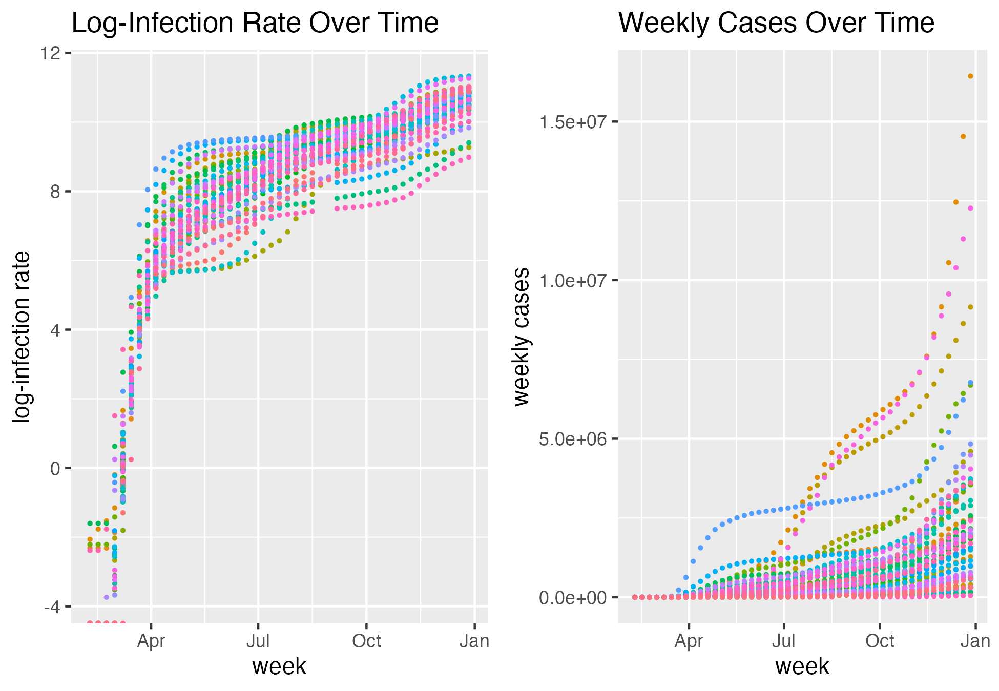
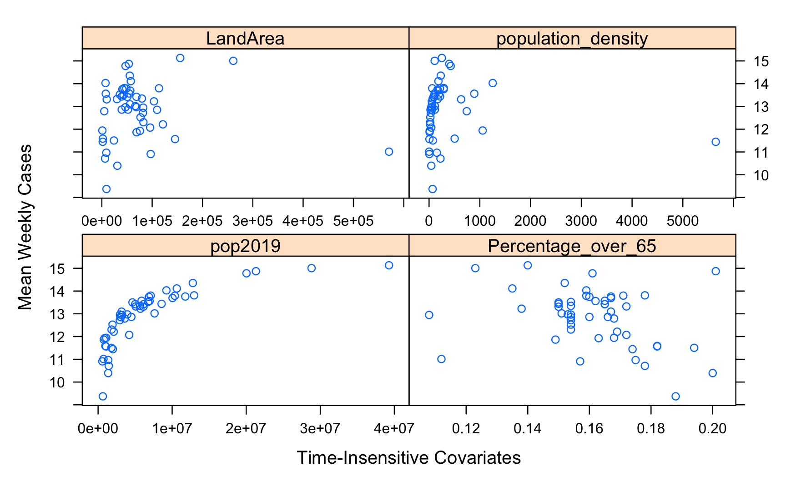
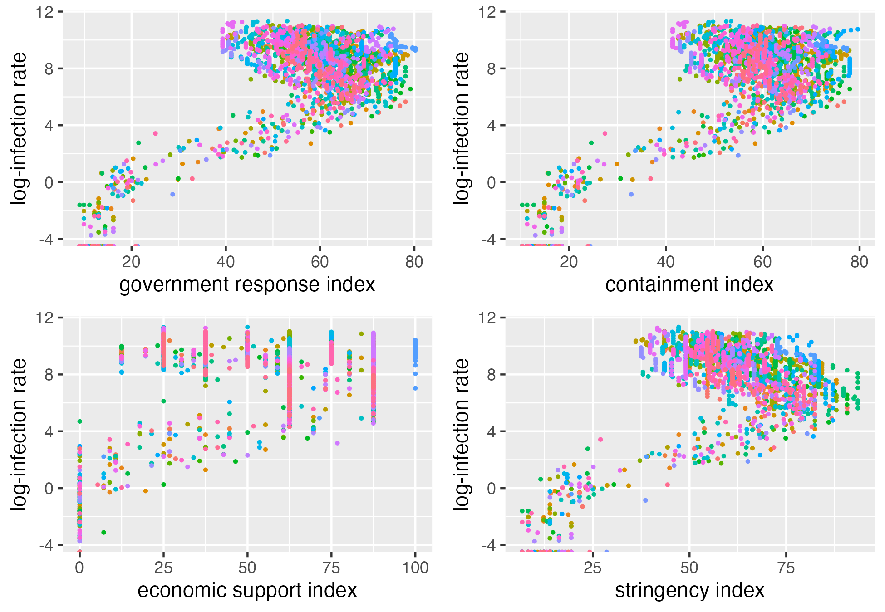
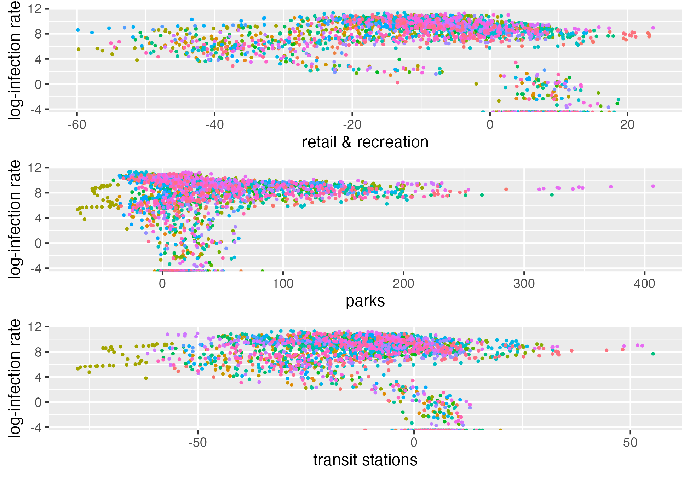

\newcommand\numberthis{\addtocounter{equation}{1}\tag{\theequation}}

```{r setup, include = FALSE, warning = FALSE, message = FALSE}
knitr::opts_chunk$set(echo = FALSE)

library(tidyverse)
library(lme4)
library(knitr)
library(kableExtra)
```


# Introduction

Since its outbreak on Dec. 1st, 2019, COVID-19 has had a profound impact on the world and caused significant disruptions in public health, economic stability, and social life. In the United States, due to the sporadic nature of public health administration, different states implemented a wide range of containment measures, economic support policies, and public health interventions in face of this unprecedented public health crisis. This project aims to investigate the state-level association of various government response measures, mobility changes in public spaces, and basic demographic landscape of each state with the spread of COVID-19 by using Bayesian hierarchical modeling techniques.

The dataset considered, `covid_working_data.csv`, is a comprehensive dataset multiple sources of information to facilitate the Bayesian hierarchical modeling of COVID-19 cases and government response, providing a good picture of the pandemic landscape in the U.S. in 2020. For each of the 50 U.S. states from the week of Jan. 26th, 2020 to Dec. 27th, 2020, it comprises the starting date of each week (`week_start`); the weekly data of the number of confirmed cases (`weekly_cases`); the weekly infection rate (`infection_rate`, calculated as the number of weekly cases divided by the total population of each state in 2019); the weekly average percentage change in mobility trends for retail and recreational places, parks, and transit stations compared to a baseline period (`retail_and_recreation_percent_change_from_baseline`, `parks_percent_change_from_baseline`, and `transit_stations_percent_change_from_baseline`, respectively); and the weekly average containment health index (`containment_index`, a composite measure of the stringency of COVID containment policies), economic support index (`economic_support_index`, measuring the extent of government financial support in response to COVID), stringency index (`stringency_index`, a composite measure of strictness of government policies including lockdowns, closures, travel restrictions, etc.), and government response index (`government_response_index`, average of the three government response indexes), each scaled from 0 to 100. In addition, state-level demographic information are also incorporated, including that of population (`pop2019`, total population of each state in 2019), land area in square miles (`LandArea`), population density (`population_density`, `pop2019`/`LandArea`), and the percentage of population aged 65 or older (`Percentage_over_65`). From preliminary exploratory analysis, we note an increasing trend in weekly cases and infection rate for each state over time (Figure 1), a slightly positive association between average weekly cases for each state and population among time-insensitive covariates (Figure 2), a positive correlation between government response indexes and log-infection rate (Figure 3), and less ostensible association between mobility changes and public spaces (Figure 4). 

To summarize, the main objective of this project is to investigate how various state-level government response measures, percent mobility changes in public locations, and demographic landscape influence COVID-19 case count in the U.S. for each state during 2020. To this end, we (1) calculated the posterior distribution of model parameters for fixed effects coefficients, population-level variance, and residual variance based on the outlined Bayesian hierarchical model; (2) designed and implemented a Metropolis Hasting algorithm for the outlined Bayesian hierarchical model and monitored the convergence of MCMC chains using diagnostic plots and summary statistics; (3) computed posterior summaries and 95% credible intervals for the effect of government interventions, mobility changes, population density, and elderly percentage on the infection rate; and finally (4) interpreted the results in the context of improving public health outcomes and bettering policy-making process. Ultimately, the insights gained from this study is hoped to help inform future policy decisions and guide effective response strategies in ongoing and future public health emergencies.

# Methods

## Model    

## Algorithm

We use a component-wise Metropolis Hastings (MH) algorithm that updates the $p$ parameters at the $k$th iteration one at a time. In contrast to the Gibbs sampler, the MH algorithm uses the full joint distribution to generate potential values, allowing us to avoid computing the full conditional posteriors for each of the parameters.

For our algorithm, we first define some notation: 

* $N_{iter}$ is the number of iterations that the algorithm was run for.

* $\theta_i^{(k)}$ and $\theta_i^{(k+1)}$ are the current and updated values, respectively, for the $i$th parameter at the $k$th iteration.

* $\boldsymbol{\theta}^{(k)} = (\theta_1^{(k)}, \theta_2^{(k)}, \ldots, \theta_p^{(k)})$ is the vector of parameters $\boldsymbol{\theta}$ at the start of the $k$th iteration.

* $\boldsymbol{\theta}_{-i}^{(k)} = (\theta_1^{(k+1)}, \theta_2^{(k+1)}, \ldots, \theta_{i-1}^{(k+1)}, \theta_{i+1}^{(k)}, \ldots \theta_p^{(k)})$ is the current vector of parameters $\boldsymbol{\theta}$ at the $k$th iteration, excluding the $i$th parameter.

* $\theta_i^*$ is the proposal value for the $i$th parameter.

* $Q_i(\theta^*|\theta_i^{(k)})$ is the proposal distribution for the $i$th parameter. More generally, the proposal distribution can also depend on $\boldsymbol{\theta}_{-i}^{(k)}$, but for our algorithm, our choice of proposal distribution depends only on $\theta_i^{(k)}$.

The algorithm is given as follows:

1. Choose starting values $\boldsymbol{\theta}^{(0)}$.

2. For the $k$th iteration where $k = 1, \ldots, N_{iter}$:

    1. For the $i$th parameter where $i = 1, \ldots, p$:
    
        1. Generate $\theta_i^*$ from $Q_i(\theta^*|\theta_i^{(k)})$.
        
        2. Calculate the MH ratio given by: 
        \begin{align*} r_i^{(k)} &= \frac{\pi(\theta_i^*, \boldsymbol{\theta}_{-i}^{(k)} | \boldsymbol{X})}{\pi(\theta_i^{(k)}, \boldsymbol{\theta}_{-i}^{(k)} | \boldsymbol{X})} \frac{Q_i(\theta_i^{(k)} | \theta_i^*)}{Q_i(\theta_i^*|\theta_i^{(k)})} \\ &= \frac{f(\theta_i^*, \boldsymbol{\theta}_{-i}^{(k)}, \boldsymbol{X})}{f(\theta_i^{(k)}, \boldsymbol{\theta}_{-i}^{(k)}, \boldsymbol{X})} \frac{Q_i(\theta_i^{(k)} | \theta_i^*)}{Q_i(\theta_i^*|\theta_i^{(k)})} \numberthis \label{eqn:1} \\ &= \frac{f(\theta_i^*, \boldsymbol{\theta}_{-i}^{(k)}, \boldsymbol{X})}{f(\theta_i^{(k)}, \boldsymbol{\theta}_{-i}^{(k)}, \boldsymbol{X})} \end{align*}
        
        3. Calculate acceptance probability $\alpha_i(\theta_i^{(k)}, \theta_i^*) = \mbox{min} \left( 1, r_i^{(k)} \right)$.
        
        4. Draw $U \sim Unif(0, 1)$. If $U < \alpha_i(\theta_i^{(k)}, \theta_i^*)$, then set $\theta_i^{(k+1)} = \theta_i^*$. Otherwise, set $\theta_i^{(k+1)} = \theta_i^{(k)}$.

For each $Q_i(\theta^*|\theta_i^{(k)})$, we use a uniform distribution. More specifically, $\theta_i^*$ is generated as $\theta_i^* = \theta_i^{(k)} + Unif(-a_i, a_i)$, where $a_i$ represents the chosen window length for the $i$th parameter. We tune $a_i$ for each of the parameters by trying different $a_i$ until we find ones that allow us to accept about 30-60% of $N_{iter}$ iterations for a parameter. We keep track of the number of acceptances by computing the number of unique $\theta_i^{(k)}$ across all $N_{iter}$ iterations. Tuning $a_i$ is important because: 1) $a_i$ being too large means the proposed moves will be too large and unlikely to be accepted, taking the chain a long time to sample the entire parameter space (i.e. the chain is sampling a lot of values outside of the support of the posterior distribution); 2) $a_i$ being too small means that the proposed moves will be too small and accepted too often, taking the chain a long time to move around the parameter space.

In equation (\ref{eqn:1}), the second equality holds since $\pi(\boldsymbol{\theta} | \boldsymbol{X}) = \frac{f(\boldsymbol{\theta}, \boldsymbol{X})}{m(\boldsymbol{X})}$, so the $m(\boldsymbol{X})$'s cancel out. Additionally, the third equality holds since $\theta_i^*$ is drawn from $Unif(\theta_i^{(k)} - a_i, \theta_i^{(k)} + a_i)$. Since the uniform distribution is a symmetric distribution, the $Q_i$'s cancel out. 

To allow the results to converge more quickly and save computation time, we choose the $\boldsymbol{\theta}^{(0)}$ at the beginning of the algorithm based on results from model fitting using the frequentist approach (under the assumption that the Bayesian and frequentist approaches will yield similar results). More specifically, we fit a linear mixed effect model (LMM) with random intercepts on log(infection rate) for the $i$th state during the $j$th week (see Table 1 for results). The LMM is given as follows:
$$\begin{aligned} log(\lambda_{ij}) = \alpha + \boldsymbol{\beta} \boldsymbol{x}^T_{ij} + \gamma P_{ij} + \delta E_{ij} + u_i + e_{ij} \end{aligned}$$
where $\alpha$ is the fixed intercept, $\boldsymbol{\beta}$ is the vector of fixed-effect coefficients associated with the vector of covariates $\boldsymbol{x}^T_{ij}$, $\gamma$ is the fixed-effect coefficient associated with population density $P_{ij}$, $\delta$ is the fixed-effect coefficient associated with the perentage of elderly population $E_{ij}$, $u_i \sim N(0, \sigma_u^2)$ is the state-specific random intercept, and $e_{ij} \sim N(0, \sigma_e^2)$ is the residual error term.


# Results

## Convergence

## Posterior Summaries

Table 2 shows the posterior means and 95% credible intervals of the parameters for mobility changes, government response, population density, and percentage of elderly population. The posterior mean is calculated by taking the mean of the MCMC chain after burn-in (i.e., last 50,000 states of the chain), and the 95% credible interval is the 2.5% and 97.5% percentiles of the chain after burn-in. Because the Government Response Index measures the overall government response to the pandemic -- including containment measures, economic support, and stringency of public health measures -- we only present the posterior results of the parameter for Government Response Index ($\beta_4$) here. Based on the posterior summeries, changes in mobility trends (compared to baseline) for retail and recreation were associated with a slight decrease in the expected log infection rate, whereas changes in mobility trends for parks and transit stations were associated with an increase in the expected log infection rate. A 1-unit increase in the weekly average Government Response Index was associated with a 4.95 unit decrease in the expected log infection rate, adjusting for the other covariates. A 1% increase in percentage of elderly population was associated with a 12.74 unit decrease in the expected log infection rate, adjusting for the other covariates. The credible interval with respect to population density suggests that population density had no significant impact on the infection rate.

# Conclusion

Our posterior results suggest that the overall government response to the pandemic may be crucial for slowing down the spread of COVID-19. Larger mobility changes in retail and recreation may also slow down the spread of COVID-19. However, the temporal order of changes in mobility trends and infection rate is unclear given the available data. A next step for future studies is thus to evaluate the lagged relationship between mobility trends and infection rate. In terms of demographics, higher percentage of elderly population appeared to be associated with lower infection rate, which may be due to other factors (e.g., less interactions among older adults). We therefore suggest further investigation on the causal mechanisms underlying the spread of COVID-19 among the younger population. Finally, population density did not appear to have a significant impact on the infection rate. There have been mixed findings in the literature regarding the importance of population density on the spread of COVID-19. Although a higher population density indicates a higher chance of being in contact with a positive case, larger cities also tend to have more resources to combat the pandemic than rural areas. More in-depth research on these relationships is thus needed to determine the important predictors for the spread of COVID-19.

\clearpage

# References

<div id="refs"></div>

# Tables and Figures

```{r, warning = FALSE, message = FALSE}
# read in data
data <- read_csv("covid_working_data.csv")

# prepare data
data <- data %>%
  mutate(
    week = week(week_start),
    log_infection_rate = log(infection_rate)
  )

# fit lmer 
fit_lmer <- lmer(
  log_infection_rate ~ retail_and_recreation_percent_change_from_baseline +
    parks_percent_change_from_baseline + transit_stations_percent_change_from_baseline +
    government_response_index + containment_index + economic_support_index +
    stringency_index + week + population_density + Percentage_over_65 + (1 | state),
  data = data %>% filter(log_infection_rate != -Inf) 
) %>% 
  suppressWarnings()

tab_lmer <- data.frame(
  Coefficient = c(
    "(Intercept)",
    "Retail/rec. % change",
    "Parks % change",
    "Transit % change",
    "Gov. response index",
    "Containment index",
    "Economic support index",
    "Stringency index",
    "Week",
    "Population density",
    "% over 65",
    "sigma_u",
    "simga_e"
  ),
  Estimate = c(
    summary(fit_lmer)$coefficients[,"Estimate"] %>% round(digits = 3),
    VarCorr(fit_lmer)$state[1] %>% sqrt() %>% round(digits = 3),
    summary(fit_lmer)$sigma %>% round(digits = 3)
  )
)

tab_lmer %>%
  kbl(
    booktabs = TRUE, linesep = "", 
    caption = "Summary of LMM fit on log(infection rate)"
  )
```

```{r, warning = FALSE, message = FALSE}
load("mchain.Rda")
mchain_last <- mchain[50001:nrow(mchain),]

t_post_summaries <- mchain_last %>%
  select(beta1, beta2, beta3, beta4, gamma, delta) %>%
  pivot_longer(cols = beta1:delta, names_to = "Parameter", values_to = "s") %>%
  group_by(Parameter) %>%
  summarise(`Posterior Mean` = mean(s),
            lwr = quantile(s, 0.025),
            upr = quantile(s, 0.975)) %>%
  mutate(`Posterior Mean` = case_when(Parameter == "gamma" ~ as.character(round(`Posterior Mean`, 5)),
                                      Parameter %in% c("beta1", "beta2", "beta3", "beta4", "delta") ~ as.character(round(`Posterior Mean`, 3))),
         lwr = case_when(Parameter == "gamma" ~ round(lwr, 5),
                         Parameter %in% c("beta1", "beta2", "beta3", "beta4", "delta") ~ round(lwr, 3)),
         upr = case_when(Parameter == "gamma" ~ round(upr, 5),
                         Parameter %in% c("beta1", "beta2", "beta3", "beta4", "delta") ~ round(upr, 3))) %>%
  mutate(`95% Credible Interval` = paste0("(", lwr, " ", upr, ")")) %>%
  select(-c(lwr, upr)) %>%
  kbl(booktabs = TRUE, linesep = "", caption = "Posterior summaries of the parameters") %>%
  kableExtra::footnote(general = c("beta1: mobility changes for retail and recreation", "beta2: mobility changes for parks", "beta3: mobility changes for transit stations", "beta4: government response index", "delta: percentage of elderly population", "gamma: population density"), general_title = "") 

t_post_summaries
```

```{r,echo=FALSE,out.width='80%',out.height='90%',fig.align='center'}

```

\begin{center}
Figure 1: Weekly Cases and Log-Infection Rate Over Time
\end{center}

```{r,echo=FALSE,out.width='80%',out.height='90%',fig.align='center'}

```

\begin{center}
Figure 2: Average Weekly Cases vs Time-Insensitive Covariates
\end{center}

```{r,echo=FALSE,out.width='80%',out.height='90%',fig.align='center'}

```

\begin{center}
Figure 3: Log-Infection Rate vs Government Response Indexes
\end{center}

```{r,echo=FALSE,out.width='80%',out.height='90%',fig.align='center'}

```

\begin{center}
Figure 4: Log-Infection Rate vs Mobility Percentage Changes
\end{center}